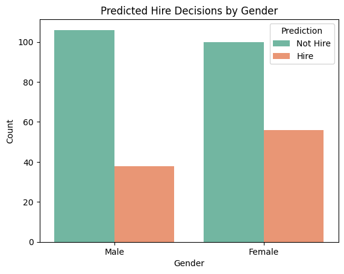

# Uncovering Bias and Explaining Decisions in a Text-Based Job Screening Model

We explore hiring decisions based on technical information as well as the gender demographic. To do so, we synthesize a text-based resume before fine-tuning BERT on a downstream classification task using a training set with representation imbalance. 

We also examine group fairness metrics and plot prediction rates across gender groups. To explain model predictions, we use SHAP to look at feature importance.
Lastly, to mitigate possible biases, we apply conterfactual data augmentation and retrain BERT. 

---

# Dataset
- 1500 synthetic records
- Generated 'resume text' from features.
- Sensitive attribute is 'Gender' (0: Male, 1: Female)
- Label: HiringDecision (0: Not Hired, 1: Hired)

# Model
- BERT (bert-base-uncased) fine-tuned over three epochs for binary classification
- 80/20 train-test split with gender imbalance (100% of male resumes, 30% of female resumes)

# Evaluation

**Before mitigation:**

(Differences are calculated female - male) 

| Metric                   | Value   |
|--------------------------|---------|
| Accuracy                 | 87%     |
| Demographic Parity Diff  | 0.037   |
| Equal Opportunity Diff   | 0.136   |
| Average Odds Difference  | 0.101   |

*Female candidates were hired slightly more frequently than male candidates.*

**After mitigation (via counterfactual data augmentation):**

| Metric                   | Value   |
|--------------------------|---------|
| Accuracy                 | 82%     |
| Demographic Parity Diff  | 0.095   |
| Equal Opportunity Diff   | 0.211   |
| Average Odds Difference  | 0.109   |

*Female candidates were hired even more frequently than male candidates.*

# Explainability
We use SHAP to explain five predictions (3 Hire/ 2 No-Hire). Before and after applying conterfactual augmentation, the model appeared to focus on the strategy used to apply and the scores.

# Mitigation Strategy
- For every male resume, added a female version, and vice versa.
- Double training set size

# Report
Please find the report in the repo.

# How to run
- Clone repo
- Run notebook.ipynb in Colab

  
